<p align="center">
  
</p>

<p align="center">
  <strong>The AI Chief of Staff for your codebase</strong>
</p>

<p align="center">
  <a href="#"></a>
  <a href="LICENSE"></a>
  <a href="#"></a>
  <a href="#agents"></a>
  <a href="#commands"></a>
  <a href="#skills"></a>
</p>

<p align="center">
  21 commands &middot; 22 specialized agents &middot; 29 skills &middot; 8 MCP tools &middot; 6 governance hooks<br>
  <em>Install and go. Visual dashboard included.</em>
</p>

<br>

---

<br>

## What is Forge?

Forge is an AI-powered development governance system that turns Claude Code into a full development platform. It adds automated quality gates, intelligent agent orchestration, and real-time project health monitoring to every project you work on. Think of it as a **Chief of Staff** that keeps your codebase healthy while you ship features.

Forge is pure markdown files that extend Claude Code's native capabilities — commands, agents, skills, hooks, and an MCP-powered governance dashboard that work the moment you install them.

<br>

## Quick Start

```bash
# 1. Install the plugin
claude plugin add nxtg-ai/forge-plugin

# 2. Initialize Forge in your project
/[FRG]-init

# 3. Check your project health
/[FRG]-status

# 4. Open the command center
/[FRG]-command-center
```

That's it. Forge is now governing your project.

<br>

## Commands

<h3 id="commands">21 slash commands across 6 categories</h3>

<table>
<tr><td colspan="2"><h4>Project Governance</h4></td></tr>
<tr>
  <td><code>/[FRG]-init</code></td>
  <td>Initialize Forge in any project — 60-second setup wizard</td>
</tr>
<tr>
  <td><code>/[FRG]-status</code></td>
  <td>Project health at a glance — git, tests, types, governance</td>
</tr>
<tr>
  <td><code>/[FRG]-status-enhanced</code></td>
  <td>Full dashboard with health score, metrics, and trend analysis</td>
</tr>
<tr>
  <td><code>/[FRG]-gap-analysis</code></td>
  <td>Find missing tests, docs, security issues, and architecture gaps</td>
</tr>
<tr>
  <td><code>/[FRG]-compliance</code></td>
  <td>License scanning and software bill of materials (SBOM)</td>
</tr>
<tr>
  <td><code>/[FRG]-command-center</code></td>
  <td>Central hub for all Forge capabilities</td>
</tr>
<tr>
  <td><code>/[FRG]-dashboard</code></td>
  <td>Open visual governance dashboard in the browser (MCP-powered)</td>
</tr>

<tr><td colspan="2"><h4>Feature Development</h4></td></tr>
<tr>
  <td><code>/[FRG]-feature</code></td>
  <td>Plan and build features with full agent orchestration</td>
</tr>
<tr>
  <td><code>/[FRG]-spec</code></td>
  <td>Generate detailed technical specifications</td>
</tr>
<tr>
  <td><code>/[FRG]-agent-assign</code></td>
  <td>Assign tasks to specialized agents from the 22-agent roster</td>
</tr>
<tr>
  <td><code>/[FRG]-integrate</code></td>
  <td>Scaffold third-party service integrations</td>
</tr>

<tr><td colspan="2"><h4>Quality Assurance</h4></td></tr>
<tr>
  <td><code>/[FRG]-test</code></td>
  <td>Run test suite with detailed failure analysis</td>
</tr>
<tr>
  <td><code>/[FRG]-deploy</code></td>
  <td>Pre-flight validation before shipping to production</td>
</tr>
<tr>
  <td><code>/[FRG]-optimize</code></td>
  <td>Performance, bundle size, and maintainability analysis</td>
</tr>
<tr>
  <td><code>/[FRG]-upgrade</code></td>
  <td>Detect and fix configuration gaps and drift</td>
</tr>

<tr><td colspan="2"><h4>State Management</h4></td></tr>
<tr>
  <td><code>/[FRG]-checkpoint</code></td>
  <td>Save a named snapshot of project state</td>
</tr>
<tr>
  <td><code>/[FRG]-restore</code></td>
  <td>Roll back to any saved checkpoint</td>
</tr>
<tr>
  <td><code>/[FRG]-report</code></td>
  <td>Generate session activity and progress reports</td>
</tr>

<tr><td colspan="2"><h4>Documentation</h4></td></tr>
<tr>
  <td><code>/[FRG]-docs-status</code></td>
  <td>Documentation health and coverage analysis</td>
</tr>
<tr>
  <td><code>/[FRG]-docs-update</code></td>
  <td>Detect and fix stale documentation</td>
</tr>
<tr>
  <td><code>/[FRG]-docs-audit</code></td>
  <td>Full documentation quality audit with actionable findings</td>
</tr>
</table>

<br>

## Agents

<h3 id="agents">22 specialized subagents</h3>

Forge agents are specialist personas that Claude Code invokes automatically based on task context. Each agent carries domain expertise, knows which tools to use, and follows proven patterns for its specialty.

| Agent | Specialty |
|:------|:----------|
| **Planner** | Architecture design, task breakdown, dependency mapping |
| **Builder** | Feature implementation with tests and documentation |
| **Guardian** | Quality gates, pre-commit checks, production readiness |
| **Security** | Vulnerability scanning, OWASP checks, secrets detection |
| **Testing** | Test generation, coverage analysis, edge case discovery |
| **Performance** | Profiling, bundle analysis, runtime optimization |
| **Orchestrator** | Multi-agent coordination and workflow management |
| **Detective** | Root cause analysis and diagnostic investigation |
| **Refactor** | Code restructuring and complexity reduction |
| **DevOps** | Docker, CI/CD pipelines, deployment automation |

<p align="right"><em>+ 12 more specialists: API, Database, UI, Docs, Analytics, Compliance, Integration, Learning, Release Sentinel, Governance Verifier, Oracle, and CEO Loop.</em></p>

<br>

## Skills

<h3 id="skills">29 auto-activating knowledge modules</h3>

Skills are contextual knowledge packages that Claude loads automatically when they are relevant to the current task. They provide framework-specific patterns, coding standards, security guidelines, and domain expertise without requiring any manual activation.

**Categories include:** core architecture, coding standards, testing strategy, security, documentation, git workflow, optimization, runtime validation, browser debugging, multi-backend frameworks (Claude Code, Codex, Gemini), agent development, skill development, and 7 specialized agent-role skills.

<br>

## Governance Hooks

**6 advisory hooks** that run automatically at key moments in your workflow:

| Trigger | Hook | What it does |
|:--------|:-----|:-------------|
| Task start | `pre-task.sh` | Syncs governance state and initializes context |
| Task complete | `post-task.sh` | Runs quality checks on completed work |
| Task complete | `audit-root-cleanliness.sh` | Flags unnecessary files in the project root |
| Task complete | `smoke-test-reminder.sh` | Reminds you to test after server or test changes |
| File write | `enforce-file-placement.sh` | Enforces file organization conventions |
| File edit/write | `governance-check.sh` | Advisory code quality and standards check |

All hooks are **non-blocking** — they observe and advise, they never prevent actions.

<br>

---

<br>

## Governance Dashboard

Forge includes an **MCP-powered governance dashboard** that opens in your browser. Run `/[FRG]-dashboard` and get a real-time visual overview of your project:

- **Health Score** — A/B/C/D/F grade with 8 quality checks (governance, git, tests, docs, types, security, file size)
- **Code Metrics** — Source files, test coverage, dependencies, largest files
- **Git Status** — Branch, commits, working tree, top contributors
- **Security Scan** — Hardcoded secrets, eval usage, npm audit vulnerabilities
- **Checkpoints** — Saved governance snapshots with timestamps

The dashboard is powered by 8 MCP tools that Claude can also use directly:

| Tool | What it does |
|:-----|:-------------|
| `forge_get_health` | Health score with letter grade and check details |
| `forge_get_governance_state` | Read governance.json (project, workstreams, metrics) |
| `forge_get_git_status` | Branch, commits, working tree status |
| `forge_get_code_metrics` | File counts, test coverage, dependencies |
| `forge_run_tests` | Auto-detect and run test suite |
| `forge_list_checkpoints` | List saved governance checkpoints |
| `forge_security_scan` | Scan for secrets, eval, .env in git, npm audit |
| `forge_open_dashboard` | Generate HTML dashboard and open in browser |

**Requirements:** Node.js 18+ (for the MCP server). Dependencies install automatically on first use.

<br>

---

<br>

## How It Works

Forge is primarily a **markdown-based plugin** — commands, agents, skills, and hooks are all plain text files. The optional MCP server adds a visual dashboard with zero configuration:

- **Commands** are markdown instructions that tell Claude Code what to do using its built-in tools (Bash, Read, Write, Glob, Grep)
- **Agents** are specialist personas invoked via Claude Code's Task tool with tailored system prompts
- **Skills** provide contextual knowledge that Claude loads automatically based on task relevance
- **Hooks** run shell scripts in response to Claude Code lifecycle events
- **MCP Server** provides governance tools and a visual dashboard

When you run `/[FRG]-feature`, for example, Forge's Planner agent designs the architecture, the Builder agent implements the code, the Testing agent writes tests, and the Guardian agent validates quality — all coordinated automatically.

<br>

## Architecture

```
Your Project
  ├── .claude/
  │   └── governance.json        # Project state (created by /[FRG]-init)
  └── CLAUDE.md                  # Project context

NXTG-Forge Plugin (loaded by Claude Code)
  ├── commands/                  # 21 slash commands
  │   ├── [FRG]-init.md
  │   ├── [FRG]-status.md
  │   ├── [FRG]-dashboard.md     # Opens visual dashboard
  │   └── ...
  ├── agents/                    # 22 specialist subagents
  │   ├── [AFRG]-builder.md
  │   ├── [AFRG]-planner.md
  │   ├── [AFRG]-guardian.md
  │   └── ...
  ├── skills/                    # 29 knowledge modules
  │   ├── architecture/
  │   ├── security/
  │   └── ...
  ├── servers/                   # MCP server (8 governance tools)
  │   └── governance-mcp/
  │       └── index.mjs          # Auto-installs deps on first run
  └── hooks/                     # 6 advisory governance hooks
      └── scripts/
          ├── pre-task.sh
          ├── post-task.sh
          └── ...
```

<br>

## Multi-Backend Support

Forge is designed for Claude Code but includes framework skills for other AI coding assistants:

| Backend | Support |
|:--------|:--------|
| **Claude Code** | Full support — commands, agents, skills, hooks |
| **Codex CLI** | Framework skill for Codex-compatible patterns |
| **Gemini CLI** | Framework skill for Gemini-compatible patterns |

<br>

## Requirements

- **[Claude Code](https://claude.ai/claude-code)** v1.0.33 or later
- **Git** (for project status and checkpoint commands)
- **Node.js 18+** (for the MCP governance dashboard — optional)

<br>

## Contributing

Forge is developed in the NXTG-Forge monorepo. Contributions, issues, and feature requests are welcome.

**Repository:** [github.com/nxtg-ai/forge](https://github.com/nxtg-ai/forge)

<br>

## License

[MIT](LICENSE) -- Copyright (c) 2026 [NXTG AI](https://github.com/nxtg-ai)

<br>

---

<p align="center">
  <sub>Built with Claude Code. Governed by Forge.</sub>
</p>
