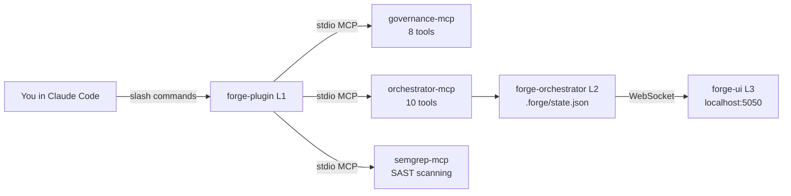

# L1 → L2 → L3: The Level-Up Journey

> Three products. Three levels. Each one works alone. Together they're a force multiplier. You choose your depth based on your pain.

---

## The 60-Second Version

| | L1: Vibe Coder | L2: Pro Builder | L3: Ship Lord |
|---|---|---|---|
| **Product** | forge-plugin | + forge-orchestrator | + forge-ui |
| **Install** | `claude plugin install nxtg-forge` | + `curl -fsSL https://forge.nxtg.ai/install.sh \| sh` | + `cd forge-ui && npm run dev` |
| **What it adds** | 33 agents, 23 commands, 33 skills, 13 hooks, 8 MCP tools | + 10 MCP tools, task management, knowledge persistence, drift detection, TUI | + Visual dashboard, Infinity Terminal, real-time feeds, multi-device access |
| **Setup time** | 30 seconds | + 2 minutes | + 5 minutes |

---

## L1: Vibe Coder (Plugin Only)

**Who it's for:** Solo developers using Claude Code who want quality checks, agent specialists, and governance without leaving the terminal.

**What you get:**
- 33 specialized agents (security, testing, API design, database, UI, performance, etc.)
- 23 slash commands (`/forge:feature`, `/forge:status`, `/forge:test`, etc.)
- 33 knowledge skills that auto-load based on context
- 13 hook scripts (4 blocking security guards + 9 advisory governance hooks)
- 8 MCP governance tools (health, metrics, git status, tests, security scan)
- 3 MCP servers: governance-mcp (always), orchestrator-mcp (if L2 installed), semgrep-mcp (if installed)

**What L1 can't do:**
- No persistent task tracking across sessions (agents forget between conversations)
- No knowledge capture (learnings from one session don't inform the next)
- No drift detection (can't compare work against your original spec)
- No file locking for multi-tool workflows
- No visual dashboard

**You're ready for L2 when:**
- You run multiple AI tools (Claude Code + Codex + Gemini) and they conflict
- You want task progress to survive between Claude Code sessions
- You want learnings from one implementation to inform the next
- You need to detect when work has drifted from your spec

---

## L2: Pro Builder (Plugin + Orchestrator)

**Who it's for:** Developers running multi-tool AI workflows who need coordination, persistent state, and knowledge accumulation.

**What L2 adds to every agent and command:**

| Capability | How It Works | MCP Tool |
|-----------|-------------|----------|
| Task management | Agents check what's assigned, claim work, mark complete | `forge_get_tasks`, `forge_claim_task`, `forge_complete_task` |
| Knowledge persistence | What agents learn in one session informs the next | `forge_capture_knowledge`, `forge_get_knowledge` |
| Drift detection | Compare current work against your original spec/vision | `forge_check_drift` |
| Project state | Shared state file at `.forge/state.json` all tools read | `forge_get_state` |
| Plan awareness | Agents read and follow your `SPEC.md` plan | `forge_get_plan` |
| File locking | Prevents two tools from editing the same file | Built into task system |
| Health scoring | 5-dimension governance health with trend tracking | `forge_get_health` |
| Event audit trail | Every action logged to `.forge/events.jsonl` | `forge_get_events` |

**The TUI dashboard:** `forge dashboard` launches a terminal dashboard with task boards, agent activity, and governance metrics — all in your terminal, no browser needed.

**You're ready for L3 when:**
- You want visual oversight (graphs, charts, health gauges)
- You need a terminal that survives browser close and network drops
- You manage a team and want a shared dashboard
- You want multi-device access (phone/tablet monitoring)

---

## L3: Ship Lord (Plugin + Orchestrator + Dashboard)

**Who it's for:** Team leads, power users, and anyone who wants visual governance with persistent terminal sessions.

**What L3 adds:**

| Feature | What It Does |
|---------|-------------|
| **Visual dashboard** | Real-time web UI at `localhost:5050` with task boards, health gauges, agent feeds |
| **Infinity Terminal** | Browser terminal that survives close, network drops, and server restarts via PTY persistence |
| **Governance HUD** | Visual display of Oracle warnings, sentinel findings, health trends |
| **Agent activity feed** | Watch agents work in real-time — which agent is doing what, on which files |
| **Multi-device access** | Dashboard accessible from any device on your network (WSL2 compatible) |
| **5 engagement modes** | CEO / VP / Engineer / Builder / Founder views — same data, different depth |

---

## How They Connect

**No code dependencies between products.** MCP is the only integration layer. Remove any product and the others keep working.

---

## Is It Worth Upgrading?

### Stay on L1 if:
- You only use Claude Code (no Codex, no Gemini)
- You don't need task state to survive between sessions
- You're working on personal projects or learning
- Terminal commands are your preferred interface

### Upgrade to L2 if:
- You run 2+ AI tools on the same codebase → file locking prevents conflicts
- You want knowledge to accumulate → what agents learn persists
- You're on a team → task assignments coordinate work
- You need drift detection → keeps work aligned with spec
- **ROI:** L2 pays for itself the first time it prevents a file conflict or recalls a past decision

### Upgrade to L3 if:
- You want visual monitoring → dashboard gives bird's-eye view
- You need Infinity Terminal → terminal that never dies
- You manage others → shared dashboard for team visibility
- You present to stakeholders → visual governance is more persuasive than CLI output
- **ROI:** L3 pays for itself the first time you don't lose a terminal session

---

## Downgrade Path

Each level can be removed independently:
- **Remove L3:** Stop `forge-ui` dev server. Everything else keeps working.
- **Remove L2:** Uninstall the `forge` binary. Plugin falls back to L1 behavior automatically — no errors, no warnings.
- **Remove L1:** `claude plugin uninstall nxtg-forge`. You're back to vanilla Claude Code.

No data is lost. `.forge/` directory, governance state, and knowledge files remain on disk.

---

*See also: [Installation](README.md#installation) | [Commands Reference](commands/README.md) | [Agents Reference](agents/README.md)*
