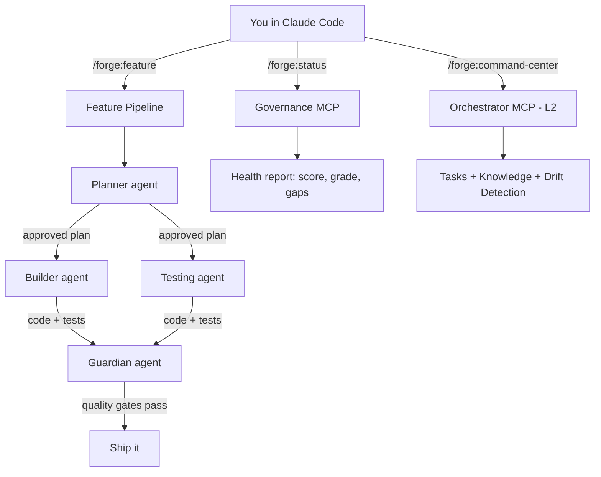

# NXTG-Forge Documentation

> Your AI Chief of Staff for software development. 33 specialized agents, 23 commands, 33 knowledge skills, 13 security & governance hooks — orchestrated intelligence that makes you mass-productive.

---

## How to Read These Docs

NXTG-Forge grows with you. Start where you are, level up when you're ready.

### L1: Vibe Coder

**What you have:** The forge-plugin installed in Claude Code.

**What you get:** All 33 agents, 23 slash commands, 33 skills, and 13 hooks (4 blocking security guards + 9 advisory governance) — working inside Claude Code with zero additional setup.

**Start here:**
1. [/forge:init](commands/init.md) — 60-second setup wizard
2. [/forge:status](commands/status.md) — see your project's health at a glance
3. [/forge:feature](commands/feature.md) — build your first feature with agent orchestration

**Read:** [Commands Reference](commands/README.md) for what you can do right now.

### L2: Pro Builder

**What you add:** The [forge-orchestrator](https://github.com/nxtg-ai/forge-orchestrator) Rust binary.

**What you unlock:** Multi-agent task management, persistent knowledge capture, vision drift detection, and cross-session memory. Agents coordinate through 10 MCP tools instead of working in isolation.

**Start here:**
1. Install: `curl -fsSL https://forge.nxtg.ai/install.sh | sh`
2. Initialize: `forge init` in your project
3. [/forge:command-center](commands/command-center.md) — activate the orchestrator

**Read:** [Agents Reference](agents/README.md) to see which agents gain orchestrator superpowers.

### L3: Ship Lord

**What you add:** [forge-ui](https://github.com/nxtg-ai/forge-ui) — the visual governance dashboard.

**What you unlock:** Real-time dashboard at `localhost:5050` with task boards, health visualizations, agent activity feeds, and the Infinity Terminal (browser-based terminal that survives disconnects).

**Start here:**
1. Clone and run: `cd forge-ui && npm install && npm run dev`
2. [/forge:dashboard](commands/dashboard.md) — open the dashboard

**Read:** The L3 sections in individual agent/command docs to see what becomes visual.

---

## Reference Sections

| Section | What's Inside | Count |
|---------|--------------|-------|
| [Agents](agents/README.md) | Autonomous AI specialists — each handles a domain | 33 |
| [Commands](commands/README.md) | Slash commands you type in Claude Code | 23 |
| [Skills](skills/README.md) | Knowledge that auto-loads when agents need it | 33 |
| [Levels](LEVELS.md) | L1 → L2 → L3 upgrade journey with feature matrix | 3 |
| [Glossary](GLOSSARY.md) | Every Forge term explained in plain language | 18 |

---

## The Architecture in 30 Seconds



**Three products, one experience:**
- **forge-plugin** (L1): 33 agents, 23 commands, 33 skills, 13 hooks (4 blocking security guards), 3 MCP servers
- **forge-orchestrator** (L2): Rust binary. Task management, knowledge, governance via 10 MCP tools.
- **forge-ui** (L3): React dashboard. Visual governance, Infinity Terminal, real-time feeds.

**Three MCP servers:**
- **governance-mcp** (Node.js, 8 tools) — always available, ships with plugin
- **orchestrator-mcp** (Rust, 10 tools) — available when `forge` binary installed (L2)
- **semgrep-mcp** (Python, SAST tools) — available when `semgrep-mcp` installed

No code dependencies between products. MCP is the only integration layer. Each works independently. Together, they're a force multiplier.

---

## Quick Reference

### Most-Used Commands
| Command | What It Does |
|---------|-------------|
| `/forge:status` | Project health at a glance |
| `/forge:feature "X"` | Build a feature with full agent orchestration |
| `/forge:test` | Run tests with detailed analysis |
| `/forge:gap-analysis` | Find gaps in testing, docs, security, architecture |
| `/forge:checkpoint` | Save state before risky changes |

### Most-Used Agents
| Agent | When You Need It |
|-------|-----------------|
| [Builder](agents/builder.md) | Implement features from approved plans |
| [Planner](agents/planner.md) | Design architecture before building |
| [Guardian](agents/guardian.md) | Quality gates before committing |
| [Detective](agents/detective.md) | "What's wrong with this codebase?" |
| [Security](agents/security.md) | Vulnerability scanning and hardening |

---

## Guides & Deep Dives

| Guide | What It Covers |
|-------|---------------|
| [C-01: What is Forge?](C-01-what-is-forge.md) | Conceptual overview — problem, solution, architecture |
| [C-02: Quick Start (L1)](C-02-quick-start-l1.md) | Get running in 5 minutes |
| [C-03: Upgrade to Pro Builder](C-03-upgrade-to-pro-builder.md) | L2 install + what changes |
| [C-04: Full Platform](C-04-full-platform.md) | L3 dashboard setup |
| [C-05: First Governed Project](C-05-first-governed-project.md) | End-to-end walkthrough: init → plan → build → ship |
| [C-06: Multi-Agent Orchestration](C-06-multi-agent-orchestration.md) | How agents coordinate (L2) |
| [C-07: Brain Config](C-07-brain-config.md) | LLM backend configuration |
| [C-08: Dashboard Guide](C-08-dashboard-guide.md) | forge-ui features and usage (L3) |
| [C-10: CLI Commands](C-10-cli-commands.md) | `forge` binary command reference (L2) |
| [C-12: MCP Tools](C-12-mcp-tools.md) | All 18 MCP tools across 3 servers |
| [C-12: Three Levels](C-12-three-levels.md) | Detailed level architecture and invariants |
| [C-14: Health Scoring](C-14-health-scoring.md) | How the 0-100 health score works |
| [C-15: Troubleshooting](C-15-troubleshooting.md) | Common issues and fixes |

---

## Installation

```bash
# Install the plugin (L1 — all you need to start)
claude plugin marketplace add nxtg-ai/forge-plugin
claude plugin install nxtg-forge

# Add the orchestrator (L2 — multi-agent coordination)
curl -fsSL https://forge.nxtg.ai/install.sh | sh
forge init

# Add the dashboard (L3 — visual governance)
git clone https://github.com/nxtg-ai/forge-ui
cd forge-ui && npm install && npm run dev
```
