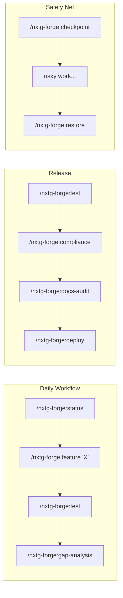

# Commands Reference

> 23 slash commands that turn Claude Code into a governed development platform. Type `/nxtg-forge:` and Tab to see them all.

---

## How Commands Work

Commands are slash-invoked actions you type directly in Claude Code. Each one is a markdown file with structured instructions — Claude reads the command definition and executes it step by step.

Commands work at **L1** (plugin only) unless noted otherwise. Some commands pull additional data from the forge-orchestrator at L2, and one command requires forge-ui at L3.



---

## Command Selection Guide

**First time using Forge?**
→ [/nxtg-forge:init](init.md) — 60-second setup, then [/nxtg-forge:status](status.md) to see your project

**Want to build something?**
→ [/nxtg-forge:feature](feature.md) orchestrates the full cycle, or [/nxtg-forge:spec](spec.md) for just the design

**Shipping code?**
→ [/nxtg-forge:test](test.md) → [/nxtg-forge:deploy](deploy.md) — test then deploy with safety checks

**Worried about quality?**
→ [/nxtg-forge:gap-analysis](gap-analysis.md) for a full audit, [/nxtg-forge:compliance](compliance.md) for licenses and regulations

**Managing state?**
→ [/nxtg-forge:checkpoint](checkpoint.md) before risky changes, [/nxtg-forge:restore](restore.md) if things go wrong

---

## All 23 Commands by Category

### Governance

Project health, quality metrics, and compliance — the bird's-eye view.

| Command | What It Does |
|---------|-------------|
| [/nxtg-forge:init](init.md) | 60-second setup wizard — detects your stack, captures your vision, creates governance config |
| [/nxtg-forge:status](status.md) | Project health at a glance — git, tests, security, governance, orchestrator state |
| [/nxtg-forge:status-enhanced](status-enhanced.md) | Deep status with dependency analysis, code quality trends, workstream breakdown |
| [/nxtg-forge:gap-analysis](gap-analysis.md) | Analyze gaps across 5 dimensions: testing, docs, security, architecture, performance |
| [/nxtg-forge:compliance](compliance.md) | License compatibility, OWASP checks, SBOM generation, regulatory scanning |
| [/nxtg-forge:command-center](command-center.md) | Activate the 4-option command center with orchestrator integration **(L2)** |

### Feature Development

From idea to implementation with agent orchestration.

| Command | What It Does |
|---------|-------------|
| [/nxtg-forge:feature](feature.md) | Full agent pipeline: Planner → Builder → Tester → Security — from description to working code |
| [/nxtg-forge:spec](spec.md) | Generate technical specifications — architecture, data flow, API contracts, test strategy |
| [/nxtg-forge:agent-assign](agent-assign.md) | Route tasks to specialized agents by type — security, testing, performance, etc. |
| [/nxtg-forge:integrate](integrate.md) | Set up third-party integrations — API keys, SDKs, connection validation |

### Quality & Testing

Test, optimize, deploy — with safety nets.

| Command | What It Does |
|---------|-------------|
| [/nxtg-forge:test](test.md) | Auto-detect test runner, execute tests, report failures, coverage, and trends |
| [/nxtg-forge:deploy](deploy.md) | Pre-flight validation + deployment — quality gates, branch state, environment checks |
| [/nxtg-forge:optimize](optimize.md) | Performance and maintainability analysis — bundle size, dependencies, complexity |

### State Management

Checkpoints and recovery — because risky changes need safety nets.

| Command | What It Does |
|---------|-------------|
| [/nxtg-forge:checkpoint](checkpoint.md) | Save a restorable governance state snapshot — use before risky changes |
| [/nxtg-forge:restore](restore.md) | Roll back governance state from a saved checkpoint |
| [/nxtg-forge:report](report.md) | Session activity report — what changed, what's pending, what shipped |

### Documentation

Keep docs alive and accurate as code evolves.

| Command | What It Does |
|---------|-------------|
| [/nxtg-forge:docs-status](docs-status.md) | Documentation health and coverage — what exists, what's missing, what's stale |
| [/nxtg-forge:docs-update](docs-update.md) | Update stale docs based on code changes — finds outdated references and suggests fixes |
| [/nxtg-forge:docs-audit](docs-audit.md) | Full documentation quality audit — completeness, accuracy, consistency |

### Setup & Maintenance

Install, configure, and keep Forge current.

| Command | What It Does |
|---------|-------------|
| [/nxtg-forge:dashboard](dashboard.md) | Open the governance dashboard in your browser **(L3 — requires forge-ui on port 5050)** |
| [/nxtg-forge:update](update.md) | Update Forge plugin to latest version (works around Claude Code git sync issues) |

### CEO Decision Loop

Autonomous strategic governance — the executive brain.

| Command | What It Does |
|---------|-------------|
| [/nxtg-forge:ceo-loop](ceo-loop.md) | Start ORBIT governance cycle — OBSERVE → REASON → BUILD → INSPECT → TURN |
| [/nxtg-forge:ceo-loop-cancel](ceo-loop-cancel.md) | Gracefully stop the CEO loop — preserves all decisions in the journal |

---

## Command Cheat Sheet

### The Daily Workflow
```
/nxtg-forge:status              # Start of session — what's the state?
/nxtg-forge:feature "add X"     # Build something
/nxtg-forge:test                # Verify it works
/nxtg-forge:gap-analysis        # Catch what you missed
```

### Before Risky Changes
```
/nxtg-forge:checkpoint          # Save state
# ... do risky work ...
/nxtg-forge:restore             # Roll back if needed
```

### Before a Release

Run these in order. Each builds confidence for the next.

| Step | Command | What It Checks | If It Fails |
|------|---------|---------------|-------------|
| 1 | `/nxtg-forge:test` | All tests pass, coverage meets threshold | Fix failing tests before proceeding |
| 2 | `/nxtg-forge:gap-analysis --scope security` | No critical security gaps | Address CRITICAL/HIGH findings |
| 3 | `/nxtg-forge:compliance` | License compatibility, SBOM clean | Replace incompatible deps |
| 4 | `/nxtg-forge:docs-audit` | Docs accurate and complete | Update stale sections |
| 5 | `/nxtg-forge:deploy` | Pre-flight checks + deployment | Fix blockers, re-run from step 1 |

**Which agents run?** Step 1 uses [Testing](../agents/testing.md). Step 2 uses [Security](../agents/security.md). Step 3 uses [Compliance](../agents/compliance.md). Step 4 uses [Docs](../agents/docs.md). Step 5 runs [Guardian](../agents/guardian.md) pre-flight (which re-runs tests + types + security).

```
# Quick version (for when you trust your pipeline):
/nxtg-forge:test && /nxtg-forge:compliance && /nxtg-forge:deploy
```

### Deep Analysis
```
/nxtg-forge:gap-analysis --scope security    # Just security gaps
/nxtg-forge:gap-analysis --fix               # Gaps + remediation plan
/nxtg-forge:status-enhanced                  # Full diagnostic
```

---

## Level Requirements

| Level | Commands Available |
|-------|-------------------|
| **L1 Vibe Coder** | All commands except /nxtg-forge:command-center and /nxtg-forge:dashboard |
| **L2 Pro Builder** | + /nxtg-forge:command-center (orchestrator integration) |
| **L3 Ship Lord** | + /nxtg-forge:dashboard (visual governance UI) |

Commands that work at L1 but gain features at L2: `/nxtg-forge:status` (adds orchestrator state), `/nxtg-forge:feature` (adds task tracking), `/nxtg-forge:gap-analysis` (adds knowledge queries).
